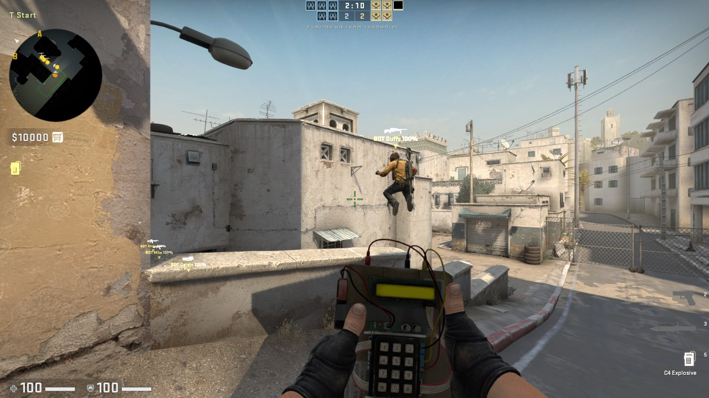
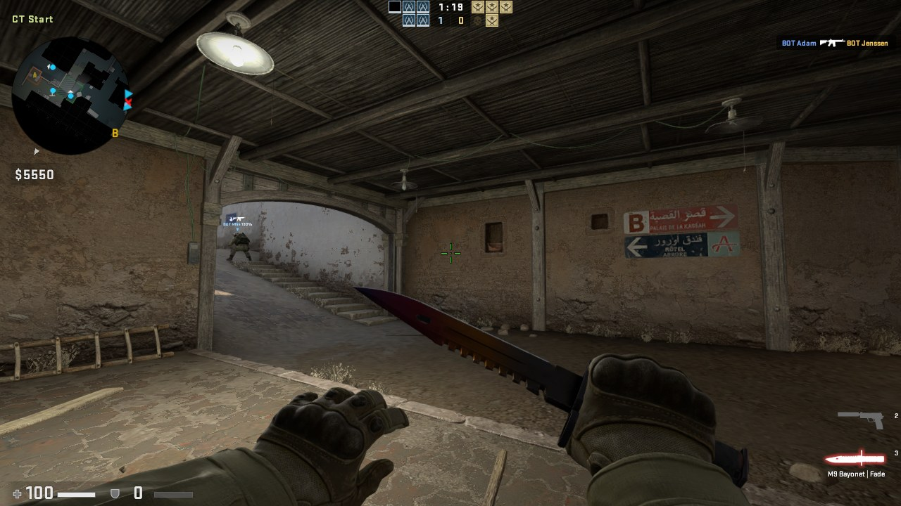

# CS:GO Family Bots

Smarter bots for a private, offline CS:GO LAN server (the legacy 1.38.8.1 build). This is a Valve server plugin that
sits on top of the stock CS:GO bots and gives them what they lack: a team plan every round, their own skill levels,
hearing, grenades, team-chat callouts and fair matchmaking. I built it for a home server where kids and grown-ups play
together against bots, so the bots go from "easier than Valve's Easy" to properly sharp, and every behaviour has its
own off switch.

**Status:** Work in progress: it runs on my home LAN server and the bots play full matches with and against the
family; it gets tuned after every playtest, and the newest defender setup (2-2-1 from hand-placed spots) has not been
through a real match yet. · **Visibility:** public · **Last updated:** 2026-10-04

No game files are included: no maps, models, sounds, Valve binaries or anything else from CS:GO. You need your own
legal copy of the game. The plugin is made for offline LAN servers only: the server runs with `sv_lan 1` and never
talks to Steam or Valve.

## Screenshots


*T side on Dust II: the bomb carrier's teammates take their route; one climbs a wall on the way.*


*CT side on Dust II: a bot pushes up the B tunnel stairs.*

## Contents

- [Screenshots](#screenshots)
- [Bot features](#bot-features)
- [Requirements](#requirements)
- [Install](#install)
- [Run](#run)
- [Placing bot spots](#placing-bot-spots)
- [Configuration](#configuration)
- [How it works](#how-it-works)
- [Project layout](#project-layout)
- [Development](#development)
- [Coming soon](#coming-soon)
- [Recent changes](#recent-changes)
- [Related repositories](#related-repositories)
- [Credits and license](#credits-and-license)

## Bot features

Everything below is in the plugin today and on by default. Items marked **(tuning)** work but are still being
adjusted after playtests; **(partial)** means it works with a known gap. Every item can be switched off on a running
server (see [Configuration](#configuration)), which brings back the earlier behaviour for side-by-side comparison.

The team-play features run in the classic modes (casual, competitive and Wingman) on bomb and hostage maps. The bot
director and the elo ratings work in every mode.

### Skill levels and personality

- **50 named bots, each with its own elo** from 300 (easier than Valve's Easy, for young kids) to 2400. There are more
  bots at the low end, where small differences matter most.
- **Ten skill dials per bot:** aim, footwork, holding angles, game sense, map awareness, utility, aggression, patience,
  teamwork and economy, plus two shooting dials: reaction time and spray control.
- **Every bot is different.** Each bot has a fixed personal offset on every dial, seeded from its name, so two bots of
  the same elo play differently. The offsets cancel out, so a bot's overall strength still matches its elo. A small
  per-match "form" adds a little variety.
- **Specialists.** About one bot in four is a specialist: Aimer, Brain (game sense), Rat (quiet and patient), Entry
  (aggressive), Nade-nerd (utility) or Anchor (holds angles).
- **Weapon styles** come from Valve's weapon templates (rifle, sniper, SMG spray, shotgun and so on); see
  [Buying and economy](#buying-and-economy) for how they buy.
- **Kid floor (tuning).** Bots under elo 700 get almost no personal boost to aim, footwork or awareness, and the
  plugin's extra skills fade to nothing at elo 300, so the lowest bots stay beatable for young players while still
  shooting back.

### Aim and shooting

- **Reaction time by rank:** from about 0.9 s from first sight to first shot at the lowest rank to about 0.5 s at
  the top (measured in bot-only test matches). No bot "dances" for two seconds before shooting.
- **Spray control by rank:** low ranks hold the trigger and spray wildly; high ranks pull the recoil down. Low ranks
  no longer strafe side to side tapping single shots.
- **First-shot accuracy and flick speed by rank:** the first-shot aim error shrinks and the turn speed rises with
  rank; low-aim bots overshoot and sway onto the target.
- **Lucky shots:** at every rank, about 15% of fights start with a first shot that is dead on (chest or head).
- **Close-range panic:** an enemy within about 400 units makes any bot, even the lowest, react fast and spray. It also
  turns to face a player who tries to run circles around it.
- **Gold-level aim (tuning):** the middle ranks (around the Gold Nova ranks) get extra sharpness so they win a fair
  share of real duels. Gold bots still play below real Gold players, so this is being worked on.
- **No free first shot:** a bot holding an angle opens fire on an enemy who walks into plain view, instead of waiting
  to be shot at first (the stock bots wait).

### Hearing and awareness

- **Bots hear you:** running footsteps, jumps and landings, gunshots (silenced shots only up close), reloads, scoping
  in, and the start of a bomb plant or defuse. Walking and crouching stay silent, just like for players.
- **They turn to where you will appear.** Higher ranks pre-aim the exact corner you will come round; lower ranks look
  the rough way. As more footsteps come in, the bot follows the runner through the wall.
- **Better bots stop to listen** for a moment and share what they heard with the team, which feeds the defenders'
  rotation calls.
- **Reaction by awareness:** how fast a bot reacts to a sound depends on its map-awareness dial. Even the lowest bots
  react, just slowly.
- **Death info:** when a teammate (bot or human) dies, the team learns where the killer was. Bots turn towards that
  spot (sooner and more reliably at higher ranks) and one of them says it in team chat.

### Movement and footwork

- **Quiet walk:** bots with good footwork shift-walk where enemies could already be, so you don't hear them coming.
  Never while on an urgent job (rotation, retake, trade, the bomb).
- **Counter-strafe:** a bot with good footwork stops dead before its first shot when it spots you while moving.
- **Move, stop, shoot:** better bots fire a burst standing still, strafe, stop and fire again, instead of standing in
  one place the whole fight. Roughly half of Gold Nova fights, almost all at the top, never at the lowest rank.
- **Reacting to being shot:** a bot turns towards a shooter it cannot see, side-steps while trading shots, and runs to
  nearby cover when it is losing the fight, then peeks again from the same place.
- **Reposition after a fight:** a holder moves to a new spot the enemy did not see.
- **Fall back when outnumbered:** a bot that two or more enemies can see backs off to a spot none of them can see.
- **Safer routes:** bots with good footwork avoid the places where their team already died this round.
- **Crouching on purpose:** bots crouch-spray by rank, and hold crouched only where the crouched view still covers the
  angle; otherwise they hold standing. The plugin finds and tests the crouch control by itself and leaves crouching
  to the stock bots if the test fails.

### Peeking and angles

- **Pre-aiming:** while moving into ground the enemy can reach, bots put their crosshair on the next likely angle
  (more often at higher ranks).
- **Jiggle peeks:** instead of walking into a corner where an enemy might be, a bot steps out just far enough to see
  it, steps back, and repeats two or three times.
- **Shoulder peeks** against a suspected AWP, to bait the shot.
- **Clearing corners on a site take:** the site's common angles are shared out among the attackers and each one checks
  its corners (40% to 100% of the time, by awareness). The team takes the site slowly (walking) or fast (running),
  changing from round to round.
- **Defenders face the entrance they hold** instead of looking in random directions; the exact angle varies between
  the entrances the attackers reach first.

### Attacking (T side)

- **Called round plans:** at freeze time the smartest T bot calls the plan in team chat ("A push", "A split",
  "B push", "B split", "B to A", "A to B", "mid to B") and the team plays it together.
- **You can overrule it:** type `a` or `b` (or "go b", "b split" and similar) in team chat during freeze time or the
  first 4 seconds. The team switches and a bot answers "ok B".
- **Plan variety:** plans change by map and round, weighted against the last few rounds, and a mid-heavy plan never
  comes twice in three rounds.
- **Group up, then hit together:** the Ts gather at a stack point, close up at the site entrance and go in together;
  sometimes after a fake, sometimes with one lurker holding another site's choke.
- **Routes match the call (partial):** every T walks its group's way in, and a bot that wanders off the called route
  is sent back to it. In the last live match some Ts still went through mid on a B call.
- **Follow the bomb:** when a human carrying the bomb heads for a site, the team re-plans to follow him ("following
  bomb B" in chat), one or two bots escort him, and the team waits at the entrance for the bomb.
- **Fair bomb carrier:** the bomb goes to a random T each round, bots included (stock CS:GO always gives it to a
  human). A bot carrier plays with the main group and goes in just behind the first ones.
- **Post-plant:** every T defends the planted bomb from post-plant spots that change from round to round, instead of
  running off.

### Defending (CT side)

- **2-2-1 setup (new, not yet playtested):** two on A, two on B, one watching mid. With humans on CT, the bots fill the
  A and B pairs first; the mid watcher is only a bot when the whole team is bots.
- **Hand-placed spots:** defenders hold spots placed by hand in the game (see
  [Placing bot spots](#placing-bot-spots)). Each bot takes a different spot, mostly not last round's, and looks where
  the placer aimed. A site with fewer than two hand-placed spots is filled from the generated ones, so every map works.
- **Older generated setup:** with the 2-2-1 setup switched off, an anchor and a second player hold each site and one
  player watches mid (or lurks), on spots that change every round; a smart team sometimes stacks a site the Ts have
  been hitting. Hostage maps have their own plan (see [Team play](#team-play)).
- **Holders hold:** a site holder does not chase noises or run off to trade a teammate; it turns to where the killer
  was instead.
- **Rare, planned pushes:** in 10-22% of rounds (never two in a row) one or two CTs that are not anchors take a
  contested spot for a few seconds and come back. A push is planned at the round start and never aimed at where the
  enemy is known to be, so it is not predictable.
- **Holders fight pushes and call them:** a holder that sees attackers coming fights them instead of watching, and
  calls it in team chat ("3 long"), which starts the rotation.
- **Rotations on information:** calls come from what the CTs see and hear and from teammates' deaths. Everyone except
  the other site's anchors rotates, leaving at slightly different times, by the direct route. A second call follows if
  the first hit was a fake.
- **Retakes:** after a plant every CT joins the retake. They gather, but hurry by the bomb clock, and the first one
  waits for the next instead of going in alone.
- **AWP on retakes:** a retaking CT with an AWP takes a long angle over the bomb instead of walking onto the site, and
  shoots without the stock sniper's delay.

### Utility (grenades)

- **Bought like a player:** after the gun and armour, each bot buys grenades with the money left (smoke, flash,
  molotov, a second flash, HE): about one at Silver, two at Gold Nova, four at the top. It uses the game's normal buy
  command, so prices, the buy zone and limits all apply.
- **Thrown on purpose, every round,** with the throw arc worked out from where the bot stands (no hand-made lineups).
  Lower ranks aim their throws a little worse, and a bot does not throw when no arc lands where it wants.
- **T executes:** smokes on the CT side of the site and a molotov on the first corner before going in (the team waits
  for the smokes), then flashes over the site as they step in.
- **After the plant:** a smoke on the retake path, and a molotov or HE on a CT who starts to defuse.
- **CT defence:** smoke, molotov, then HE on the Ts' way in while they are still outside; flash and HE once they reach
  the entrance. Retakers flash over the bomb and smoke or molotov the post-plant spots (never the bomb itself).
- **Both sides:** HE or molotov on two or more enemies they know about, sometimes a flash before peeking an enemy they
  know is there, and leftover grenades used late in the round.
- **Spread out:** one throw at a time per bot, a team's throws spaced out, never while fighting, planting or
  defusing.
- **Teammate check (partial):** a bot about to throw a molotov or HE that would land on a teammate or at its own feet
  aims up instead. It is not yet proven that this always stops the throw on this game build.

### Buying and economy

- **Team buys:** each round the team decides together: full buy, force buy or eco. On an eco the bots save together
  (the plugin holds their money during freeze time and hands every dollar back afterwards, checked against the server
  log). Low-elo teams buy bot by bot, like beginners do.
- **Income never changes:** bots earn exactly what players earn; only what they buy changes.
- **Beginner buys:** below elo 350 a bot spends at most $2500 a round (an SMG and armour, or a cheap rifle), rising to
  no limit at elo 550.
- **Rifle first:** sniper-style bots buy a rifle (FAMAS or Galil, else the Scout) unless they are the team's one AWP
  this round: the richest sniper bot with at least $5750.

### Team play

- **Trades:** when a teammate dies, the nearest bot follows up on the killer (site holders turn to the killer
  instead of running off).
- **Regroup when outnumbered:** a team down by two or more players falls back and holds together (before the plant).
- **Hostage maps:** CTs push straight in and escort the teammate carrying a hostage; Ts guard and hold around the
  hostages instead of collapsing onto one point; no trade runs or fall-backs there.

### Callouts and team chat

- **Plan calls** by a T bot at freeze time, and **"ok B"** when a human overrules the plan.
- **"following bomb B"** when the team follows a human bomb carrier.
- **Push calls** by defenders, using the way in: "3 long", "2 mid".
- **Death calls:** "Ian died long, 2 there" (Ian is one of the bots).
- **Spot commands answer in chat** ("A spot 1 saved (1 on A)").
- **How bots talk:** the plugin runs the game's own team-chat command for the bot. If it cannot find that safely when
  the map loads, plan calls go out as a console message instead, and only when no human is on CT (so the plan does
  not leak to the other team).

### Matchmaking and difficulty

- **Bot director:** the plugin adds the bots itself and picks them from the roster so that each team's average elo
  (humans plus bots) matches the humans playing. Playing solo means bots at your elo. Bots are swapped at a round end.
- **Pick the bots' rank:** one line `bot_elo <elo>` in the settings file makes the bots play at that level instead of
  following the humans. `tools/botrank.py` maps the 18 CS:GO ranks to elo (see [Run](#run)). Each bot keeps a little
  spread around it.
- **Elo after every match:** after each competitive or Wingman match, every human and every bot gets a standard
  team-elo change (K 32 for the first 10 games, then 16). Humans start at 300 (Silver I). Bot-only matches are not
  rated.
- **18 ranks:** elo maps to the 18 competitive ranks, Silver I (300 and below) to Global Elite (2400 and up), stored
  with each person's elo.
- **No automatic difficulty swapping:** the game's own "swap bots by score" is off, so the director is in charge.

### Map knowledge

- **Map points generated, not hand-made:** `bots/make_mapinfo.py` reads each map's navigation mesh (`.nav`) and map
  entities (`.bsp`) and writes bomb sites, entrances and chokes, stack points, hold spots, post-plant spots, lurk
  spots, retake gathering points, CT rotation routes, up to three T approaches per site, the mid areas, a "who can be
  where first" timing grid, and every cover spot.
- **Hand-placed spots** with in-game console commands (see [Placing bot spots](#placing-bot-spots)).
- **Fallback:** a map without a `.nav` file or without objectives just gets the stock bots.

### Party and server rules

These live in `plugin/family_party.cpp` and `overlay/csgo/cfg/family.cfg`, and suit a home server where everyone
plays in one game:

- **Auto team:** "Auto" on the team-select screen puts you with the other humans while there is room, then on the
  other team, and only when both are full do you spectate. Picking T or CT yourself always works.
- **Drop in, drop out:** a joining human takes a bot's place, and the game is always running (no hibernation, no
  idle kicks).
- **Mode switch (partial):** when nobody else is on, the first player's Play-menu choice switches the server's mode
  and map. This needs a matching change to the game client's menu, which is not in this repo.
- **Bots play the objective with humans on the team:** they plant, defuse and go for the bomb even when a human is on
  their team (Valve's competitive config switches that off).

### Safety and testing

- **Off switch for everything:** `csgo/addons/family_test.txt` is read again every second on the live server.
- **Humans are never touched.** The plugin only steers the stock bots' own goals, and never while a bot is fighting,
  planting, defusing, buying or picking up the bomb.
- **Self-checks:** on every map load the plugin checks the bots' memory layout by class name. If anything does not
  match, steering switches itself off for that map and the stock bots play. Memory reads are guarded so a bad read
  cannot crash the server.
- **Proof in the log:** one summary line per round (plus lines per fight, throw, rotation and so on) in
  `csgo/addons/family_brain.log`, written with each feature on or off, so before/after can be compared.
- **Built-in test drills:** a circling test (can you run circles around a bot?), a hearing test (does it hear a
  runner behind it, and not a walker?), a walk-up test (how fast does a holder shoot?) and a grenade check.
- **Unit tests** for the decision rules (`plugin/test_pick.cpp`), run before every build.

## Requirements

- **CS:GO legacy, build 1.38.8.1** (Steam app 4465480): the game content from your own copy (depot 731, plus its
  manifest file), and the Linux dedicated-server files of the same build (depot 740).
- **Linux or WSL2 with Docker Engine and Docker Compose.** The container is Ubuntu 22.04 with the 32-bit libraries.
- **Python 3** for the generators and the RCON helper.
- **g++ with 32-bit support** (`g++-multilib`, C++17) to build the plugin.
- **[gbe_fork](https://github.com/Detanup01/gbe_fork)** (an offline Steam stand-in) and
  **[csgo_gc](https://github.com/mikkokko/csgo_gc)** (a local Game Coordinator) so the server never talks to Steam.
  Build them from their own sources and use their own sample configs; their binaries are not in this repo.
- **Game clients** on the same LAN running CS:GO legacy 1.38.8.1 without Steam. I use the same two projects on the
  client side; that client setup is not part of this repo.
- The plugin only works on the **Linux x86 server, build 1.38.8.1**: it uses memory offsets measured on that build.
  Windows servers are not supported.

## Install

These steps come from the scripts in this repo. They have only been run on my own server PC, never on a fresh one.

1. Get the code:

   ```bash
   git clone https://github.com/DaffyDabz/csgo-family-bots.git
   cd csgo-family-bots
   ```

2. Build and test the plugin. Either run `plugin/build.sh` as root (it uses a builder image called
   `family/csgo-gc-builder`; any Ubuntu image with `g++-multilib` works), or build directly:

   ```bash
   cd plugin
   g++ -m32 -O2 -std=c++17 -o test_pick test_pick.cpp family_party.cpp family_brain.cpp -lpthread && ./test_pick
   g++ -m32 -O2 -std=c++17 -shared -fPIC -fvisibility=hidden -static-libstdc++ -static-libgcc -Wall \
       -o ../overlay/csgo/addons/family_party.so family_party.cpp family_brain.cpp -lpthread
   cd ..
   ```

3. Build gbe_fork and csgo_gc from their repos and put their files where `.gitignore` lists them:
   `overlay/bin/steamclient.so` (gbe_fork), `overlay/srcds_linux` and `overlay/csgo_gc/csgo_gc.so` (csgo_gc).
4. (Optional) edit `bots/roster.txt` and regenerate the bot files:
   `python3 bots/make_botprofile.py --elo none`.
5. Put the game files in place. The defaults are `/srv/csgo/server-bin` (depot 740), `/srv/csgo/game` (the game
   install) and `/srv/csgo/ds-manifest` (the depot 731 manifest, used to symlink the 32 GB of content instead of
   copying it). To use other folders, export `CSGO_SERVER_BIN`, `CSGO_CLIENT` and `CSGO_MANIFEST_DIR` in the root
   shell you use for the next two steps (`docker-compose.yml` reads `CSGO_CLIENT` too).
6. As root, copy the server files to `/opt/csgo` and build the server tree:

   ```bash
   bash deploy.sh --assemble
   ```

7. Start it: `/opt/csgo/csgo-ctl.sh start`. The server listens on UDP 27025 (RCON on TCP 27025). Allow UDP 27025
   through the server PC's firewall for the LAN.
8. Maps without a `.nav` file need one generated once in the server console (`sv_cheats 1`, `nav_generate`, then
   `sv_cheats 0`). Keep the `.nav` in `overlay/csgo/maps/` and assemble again so `make_mapinfo.py` can find points
   for that map.

Only the plugin and the generators are "the bots"; the container scripts are how my server runs them. You can also
drop `family_party.so`, `family_party.vdf` and the files in `overlay/csgo/addons/` into any legacy CS:GO Linux server
of the same build.

## Run

- Control the server (as root): `/opt/csgo/csgo-ctl.sh start|stop|restart|status|logs [n]|cmd <rcon text>|assemble`.
- Join from a game client on the LAN: open the console and type `connect <server-ip>:27025`. Pick a team or "Auto".
- The server starts in casual on de_dust2 with the map group `mg_family` (de_dust2, de_mirage, de_inferno,
  de_overpass, de_train, de_cache, de_nuke, de_vertigo). Change mode and map over RCON, for example competitive on
  Mirage: `/opt/csgo/csgo-ctl.sh cmd "game_type 0; game_mode 1; changelevel de_mirage"`.
- Set the bots' rank: add the line `bot_elo 1103` (Gold Nova I) to `/opt/csgo/server/csgo/addons/family_test.txt`.
  It takes effect without a restart. Delete the line and the bots follow the humans' elo again.

| Rank | `bot_elo` | Rank | `bot_elo` | Rank | `bot_elo` |
|---|---|---|---|---|---|
| Silver I | 362 | Gold Nova I | 1103 | Master Guardian Elite | 1844 |
| Silver II | 485 | Gold Nova II | 1226 | Distinguished Master Guardian | 1968 |
| Silver III | 609 | Gold Nova III | 1350 | Legendary Eagle | 2091 |
| Silver IV | 732 | Gold Nova Master | 1474 | Legendary Eagle Master | 2215 |
| Silver Elite | 856 | Master Guardian I | 1597 | Supreme Master First Class | 2338 |
| Silver Elite Master | 979 | Master Guardian II | 1721 | Global Elite | 2462 |

## Placing bot spots

Defenders use spots you place yourself, one map at a time.

1. Turn on the developer console in your game client (`con_enable 1`) and join the server.
2. Stand where a defender should hold, aim where it should look, and crouch if it should hold crouched.
3. Type one of these in the console (the client passes commands it does not know to the server):

   | Command | What it does |
   |---|---|
   | `bot_asitespot<N>` | save spot N on A here (the same N again moves it) |
   | `bot_bsitespot<N>` | save spot N on B |
   | `bot_midspot<N>` | save mid spot N |
   | `bot_deleteasitespot<N>`, `bot_deletebsitespot<N>`, `bot_deletemidspot<N>` | remove spot N |
   | `bot_spots` | count this map's spots |

   The number can also be a separate word (`bot_asitespot 3`). The server answers in chat, for example
   "A spot 1 saved (1 on A)".
4. Spots are saved in `csgo/addons/family_spots/<map>.txt`, one line per spot:
   `<A|B|MID> <n> <x> <y> <z> <pitch> <yaw> <crouch>`.

Tip: for an empty server while placing, add `director 0` to `family_test.txt` and kick the bots
(`/opt/csgo/csgo-ctl.sh cmd "bot_kick"`). Delete `director 0` afterwards, or no bots will join.

## Configuration

| File | What it holds |
|---|---|
| `overlay/csgo/cfg/family.cfg` | the server settings, used in every mode (bots, teams, logging, `sv_lan 1`) |
| `overlay/csgo/cfg/gamemode_*_server.cfg` | per-mode extras (`bot_quota 0` so the director adds the bots, 30 s warmup in ranked modes) |
| `overlay/csgo/gamemodes_server.txt`, `mapcycle.txt` | the `mg_family` map group |
| `bots/roster.txt` | the bots: name, weapon template, starting elo, specialist |
| `csgo/addons/family_test.txt` (on the server) | switches and overrides, one `name value` per line, no comments; re-read live |
| `csgo/addons/family_spots/<map>.txt` | hand-placed spots |
| `csgo/addons/family_maps/<map>.txt` | generated map points (rebuilt on every assemble) |
| `csgo/addons/family_elo.json` | the live elo of every person and bot |
| `csgo/addons/family_brain.log`, `family_party.log` | the bot brain's and the plugin's logs |

Environment variables: `CSGO_SERVER_BIN`, `CSGO_CLIENT`, `CSGO_MANIFEST_DIR` (game files), `START_MAP`, `EXTRA_ARGS`
(server start), `CSGO_PORT` (for `rcon.py`). The RCON password is generated on first start into
`/opt/csgo/rcon_password` and never stored in the repo.

The main switches for `family_test.txt` (all on, `1`, by default unless noted; write `name 0` to turn one off):

| Switch | Turns off |
|---|---|
| `brain_steer` | team-play steering (plans, holds, rotations); the log keeps running |
| `brain_shoot`, `brain_gold` | the shooting dials; the extra Gold-level aim |
| `brain_hear`, `brain_fire`, `brain_deathinfo` | hearing; reacting to being shot; death info |
| `brain_peek`, `brain_clear`, `brain_ctface` | pre-aim and jiggle peeks; corner clearing; defenders facing their entrance |
| `brain_walk`, `brain_stopshot`, `brain_safe`, `brain_move`, `brain_crouch` | quiet walk; stop to shoot; safer routes; move-stop-shoot fights; chosen crouching |
| `brain_hand`, `brain_ctq`, `brain_ctset`, `brain_ct` | the 2-2-1 setup from hand spots; the generated CT setups |
| `brain_ctpush`, `brain_react`, `brain_rotate`, `brain_retake` | planned pushes; holders fighting and calling pushes; rotation timing; retake rules |
| `brain_plan`, `brain_callroute`, `brain_follow`, `brain_c4fair`, `brain_post` | T plan calls; routes matching the call; following the bomb; fair bomb carrier; post-plant |
| `brain_util`, `brain_nade` | grenade buying and throwing; the teammate check |
| `brain_dials`, `brain_kidbuy`, `brain_riflefirst` | per-bot dial offsets; beginner buys; rifle first |
| `brain_cover` | (off by default) hiding at the nearest covered spot |
| `director` | the bot director (`director 0` = no bots are added) |
| `bot_elo <elo>`, `target <elo>` | (overrides) the bots' level; the target elo when no human is on |
| `rate_bots 1` | (test) rate bot-only matches too |

Most switches have finer sub-switches and test values; they are listed in the comment block at the top of each part
in `plugin/family_brain.cpp`.

## How it works

`plugin/` is a Valve server plugin (`ISERVERPLUGINCALLBACKS002`) for the 32-bit Linux server. It needs no Source SDK:
the few engine interfaces it uses are called through their vtables.

- **The brain** (`family_brain.cpp`) steers the stock `CCSBot` state machine (MoveTo, Hide and so on) by writing the
  goal and switching state, with the memory layout found by RTTI class names on every map load. Skill changes are
  written into each bot's live bot profile, so Valve's own aim and fight code does the shooting. Bots talk, buy and
  throw through the game's own commands, run for the bot the way the engine runs a player's command.
- **The party layer** (`family_party.cpp`) owns the plugin object, the team rules, the roster, the director and elo.
  It tails the server log for match start, round ends, scores, money, kills and chat, and runs map and mode changes
  over a local RCON connection.
- **The pure decision rules** (`family_logic.h`) are shared with the unit tests.
- **The generators** (`bots/`) build `botprofile.db`, the roster and the per-bot dials from `roster.txt`, and the map
  points from each map's `.nav` and `.bsp`.

If the memory layout ever does not match, steering switches itself off for that map and the stock bots play.

## Project layout

| Path | What |
|---|---|
| `plugin/family_party.cpp` | the plugin object, party rules, roster, director, elo, log reader |
| `plugin/family_brain.cpp` | the bot brain (round plans, steering, dials, shooting, hearing, utility, ...) |
| `plugin/family_logic.h` | pure decision rules shared with the unit tests |
| `plugin/test_pick.cpp` | unit tests (run before every build) |
| `bots/make_botprofile.py` | `roster.txt` -> `botprofile.db`, `family_roster.txt`, `family_dials.txt` |
| `bots/make_mapinfo.py` | map points from `.nav` + `.bsp` (`test_mapinfo.py` = its tests) |
| `overlay/` | server configs and generated bot files copied over the server install |
| `Dockerfile`, `docker-compose.yml`, `entrypoint.sh`, `assemble.sh`, `deploy.sh`, `csgo-ctl.sh` | the server container |
| `rcon.py`, `udptcp.py` | small RCON client; UDP-over-TCP hop for a client on the same PC as a WSL server |
| `tools/botrank.py` | the 18 CS:GO ranks to bot elo; reads and writes the `bot_elo` line |

## Development

- Build and unit-test the plugin: `bash plugin/build.sh` (or the two `g++` lines in [Install](#install));
  `test_pick` prints `ALL PASS`.
- Test the map tool: `cd bots && python3 test_mapinfo.py` (a synthetic map, no game files needed).
- See the generated bot values: `python3 bots/make_botprofile.py --elo none --print` (or `--dump` for every bot's
  dials and specialist).
- Deploy a new build: `bash deploy.sh --assemble` as root (it stops the server, rebuilds the tree and starts it).
- Each feature writes proof lines to `csgo/addons/family_brain.log`; changes are judged with bot-only test matches
  first, then a real playtest.

## Coming soon

> Keep this list current: when an item ships, move it to Recent changes with the date, then add what is next.

- [ ] Playtest the new 2-2-1 defender setup with hand-placed spots in real matches.
- [ ] Hand-placed spots for every map in the map group, de_dust2 first.
- [ ] Find why some defenders walked out towards the attackers at round start in a live match (never seen in
      bot-only tests).
- [ ] Make every T follow the called route all the way (some still cut through mid).
- [ ] Faster rotations that are staggered and cover each other: one moves while another watches.
- [ ] Smarter bots at every rank: Gold-rank bots still play below real Gold players.
- [ ] Prove the grenade teammate check works on this game build.

## Recent changes

- 2026-10-04 Public snapshot; README with the full list of bot features.
- 2026-09-29 Hand-placed bot spots from the in-game console; defenders set up 2 on A, 2 on B, 1 watching mid.
- 2026-09-29 Defenders hold their sites and fight and call pushes; death info for the team; T routes follow the call;
  defenders face the entrance they hold.
- 2026-09-26 Rare planned CT pushes, new CT setup, faster rotations, grenades bought and thrown every round,
  move-stop-shoot fights, chosen crouching.
- 2026-09-26 Hearing, reacting to fire, CT anchors and rotations on information, team-chat plan calls with the a/b
  overrule, follow the bomb, fair bomb carrier, plan variety, peeks, Gold-level aim, corner clearing, post-plant,
  retakes.
- 2026-09-26 Shooting by rank: reaction and spray dials, lucky first shots, close-range panic.
- 2026-09-25 Bot rank override (`bot_elo`), beginner buys for the lowest bots, safer routes, rifle first for
  special-weapon bots.
- 2026-09-24 Per-bot skill dials and specialists; quiet walk and stop to shoot.
- 2026-09-24 Team play: site holds, rotations, retakes, group hits, lurker, post-plant, trades, team buys; hostage
  maps.
- 2026-09-23 Bot director with a 50-bot elo roster, elo after every match; party and drop-in rules.

## Related repositories

- https://github.com/DaffyDabz/toontown-classic-bots
- https://github.com/DaffyDabz/club-penguin-bots

## Credits and license

- Counter-Strike: Global Offensive and its stock bot AI are Valve's. This is a fan-made server plugin; it includes no
  game files.
- [gbe_fork](https://github.com/Detanup01/gbe_fork) and [csgo_gc](https://github.com/mikkokko/csgo_gc) make the
  offline server possible (see their repos for their licenses).
- The bot names in `bots/roster.txt` are the classic CS bot names.

The plugin, scripts and configs here are by DaffyDabz, released under the [MIT License](LICENSE). Valve's game and its stock bot AI are not covered.
